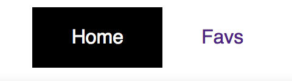
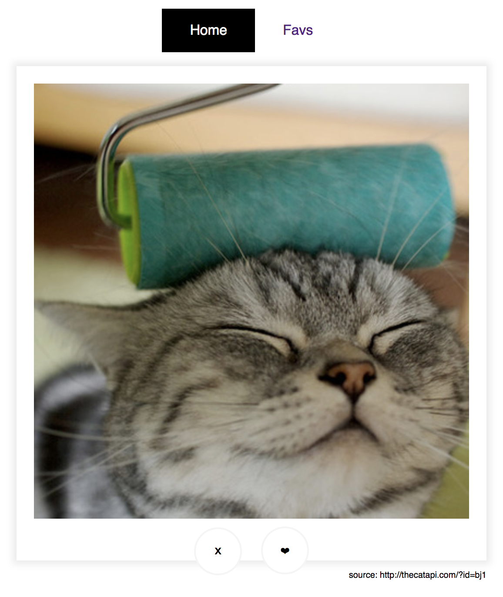
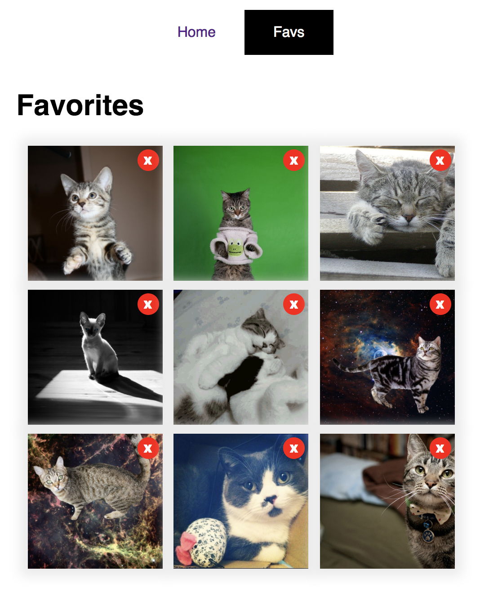

# Task Interview (catastic)

Pair programming for front-end candidates

## The Rules 📐

- You will have 90 min to get as much done as you can
- Searching online is allowed
- Asking questions is allowed and encouraged
- Best coding practices are encouraged
- Using Javascript libraries is allowed, ask to your interviewer first
- Using UI libraries is not allowed
- We recommend to follow specs in the given order
- Remember `Perfection is always the best option, but isn't strongly required.`.

## Prepare your environment 💻

Make sure your system meets the following requirements:

- node >= 8.9.3
- npm >= 5.5.1
- a [modern browser](https://browsehappy.com/)

## Launch the application 🚀

Install required packages:

```bash
$ npm install
```

Use the following command to run the app:

```bash
$ npm start
```

## HTML & CSS

The layout is pretty simple. You don't need any css library, right? 😉 

Remember that we should not be able to distinguish between the mock and your final result.

**Spec**

1. A navigation menu displaying two links: Home, Favs. (Home has the "current" state).



2. Homepage:

    1. It should display a big image horizontally centered. Don't forget the shadow!
    2. Below the image, a couple of rounded buttons. The graphics are these characters: "❤", "𝗫". Feel free to copy-paste them.



3. Favs:

    The required markup to display few images as a grid. We don't care about the grid dimensions, however:

    1. The grid should display perfectly aligned images.
    2. Try to fill each row with as much images as possible 👀.
    3. Each image should have its own delete button.



`💡 Note: The API will not return perfect square images, take care of the proportion with css!`

## JS

Let's start adding functionality to our app!

Our first functional requirement is pretty obvious: we need to change the page rendered 📺.

4. By default Homepage should be displayed.
5. When "Favs" link is clicked, Favs section should be displayed.
6. The same for "Homepage" link, when clicked display Homepage section.

`💡 Note: Updating the url is not required, but nice to have.`

## AJAX

Now our app should interact with the API service.

**Spec**

7. Homepage:

    1. Use the service provided to get and display a random image.
    2. "Dismiss" button should retrieve and display another random image.
    3. "Like" button should register the fav in the service, and then, to retrieve and display another random image.

`💡 Note: Earn bonus points by adding a "Loading" message!`

8. Favs:

    1. Use the service provided to retrieve and display all favorited images.
    2. When "Delete" button in clicked, inform to the service that the image should be removed from favs and update the list accordingly.
    
The API is pretty simple, when running the server you can check the details here: [http://localhost:8080/docs/](http://localhost:8080/docs/).

## Unit Testing

Shouldn't all code be tested it? 🔨

Show us how you test your code. Here functionality examples you can test:

1. Buttons callbacks.
2. Ajax methods with a stub for the api service.

Easy Peasy huh? Good luck and feel free to ask any questions! 👾

Cat tax:

[kitty animation](https://i.imgur.com/LbPsLrC.gif)
